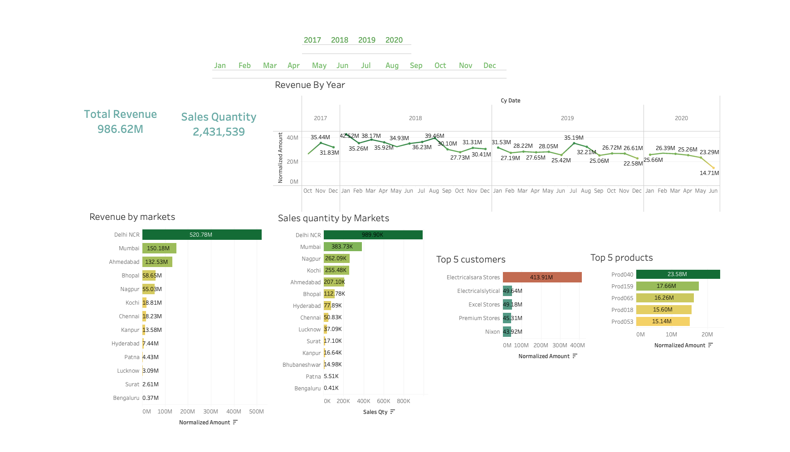

# Sales-Insights-Atliq-Hardware

Atliq HArdware is a company which supplies the hardware peripherals to different clients as nomad and excel stores. These are all the clients and this is a hardware company which will supply computers and other networking equipments to them. The sales are declining for this company and a sales director is having a lot of struggle tracking where the business is failing and the sales director don'thave any idea on what ia actually happening at the groound level.

## Problem Statement
To reveal previously hidden sales insights for the sales teams decision support and automate them to reduce manual data collection times.

## Inputs
customers.xlsx: customer_code, customer_name, customer_type

dates.xlsx: date, cy_date,	year,	month_name,	date_yy_mmm

markets.xlsx: markets_name, markets_code, zone

products.xlsx: product_code, product_type

transactions.xlsx: product_code,	customer_code,	market_code,	order_date,	sales_qty,	sales_amount,	revenue	currency, profit_margin,	profit,	cost_price

## Data Analysis using MYSQL Workbench
1. Show all customer records
  
   SELECT * FROM customers;

2. Show total number of customers

   SELECT count(*) FROM customers;

3. Show transactions for Chennai market (market code for chennai is Mark001)

   SELECT * FROM transactions where market_code='Mark001';

4. Show distrinct product codes that were sold in chennai.

   SELECT distinct product_code FROM transactions where market_code='Mark001';

5. Show transactions where currency is US dollars.

   SELECT * from transactions where currency="USD"

6. Show transactions in 2020 join by date table.

   SELECT transactions.*, date.* FROM transactions INNER JOIN date ON transactions.order_date=date.date where date.year=2020;

7. Show total revenue in year 2020.

   SELECT SUM(transactions.sales_amount) FROM transactions INNER JOIN date ON transactions.order_date=date.date where date.year=2020 and transactions.currency="INR\r" or transactions.currency="USD\r";

8. Show total revenue in year 2020, January Month.

   SELECT SUM(transactions.sales_amount) FROM transactions INNER JOIN date ON transactions.order_date=date.date where date.year=2020 and and date.month_name="January" and (transactions.currency="INR\r"    or transactions.currency="USD\r");

9. Show total revenue in year 2020 in Chennai.

   SELECT SUM(transactions.sales_amount) FROM transactions INNER JOIN date ON transactions.order_date=date.date where date.year=2020and transactions.market_code="Mark001";

## DASHBOARD

## End Result:
An automated dashboard providing quick latest and accurate sales insights in order to support data driven decision making.
The insights contain the followin queries:
* Revenue by Markets
* Sales Quantity by Markets
* Profit Margin by Markets
* Profit trend by Year
* Revenue by Year
* Top 5 Customers by Profit and Revenue
* Top 5 Products by Profit and Revenue

## Success Citeria:
* Uncovering sales insights with lates data available. 
* Enabling sales team to take better decisions and prove 10% cost savings of total spend.
* Sales analysts stop data gathering manually thus, saving 20% of their business time and reinvesting it in value added activities.

## Recommndations:
Based on the dashbaords insights, I have made some recommendation that Sales Marketing team should/can -

1. consider making a sales strategy for especially lucknow since its showing lowest revenue and negative profit margin and if possible so as for Surat and Bhubhaneshwar also.
2. try to increase its sales quantity in Patna, Surat and Kanpur since they have lowest sales quantity.
3. start their target campagin for Prod047 and Prod061 since they two are the most profitable and most selling products.
4. try to give special benefits to Electronics and _Excel store_s as they are their most profitable customers.
5. make their campgain strategy for mid year as they are showing high sales among other months.
